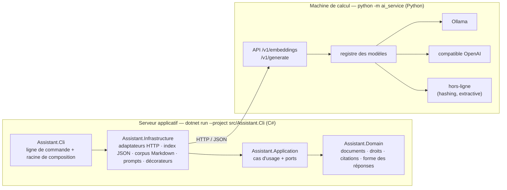

# Assistant documentaire RAG — version C# / Python

**Concevoir une application IA maintenable avec la Clean Architecture : jusqu'où peut-on isoler le modèle ?**

La même application que [`fyc-assistant-rag-python-full`](https://github.com/arthur-herve/fyc-assistant-rag-python-full) (Python), avec **l'application en C#**
et **les modèles d'IA en Python**. Les deux programmes ne partagent que le contrat HTTP
(`docs/contrat-http.md`) : ni code, ni langage, ni bibliothèque. C'est l'argument de la séquence 2.3
poussé jusqu'au bout — en entreprise, les machines de calcul hébergent les modèles, les serveurs
applicatifs hébergent l'application, et les deux équipes n'écrivent pas forcément dans le même langage.

- Application : **.NET 8**, C# 12, aucun paquet tiers (`System.Text.Json`, `HttpClient`) ; xUnit pour les tests.
- Service IA : **Python 3.11+**, bibliothèque standard, identique à celui de la version Python (copié tel quel).
- Mode hors-ligne intégré (embeddings hachés, générateur extractif) : tout fonctionne sans modèle ni GPU.
- Vrais modèles via [Ollama](https://ollama.com) : `bge-m3` + `llama3.2:3b` dans la configuration `config/app-ollama.json`, comme la version Python.
- Banc d'essai, cinq expériences reproductibles, test statistique, exemple jouet de la séquence 1.3, neuf ADR : tout ce que le cours promet est dans ce dépôt (voir « Où la problématique apparaît dans le code »).

**Par où commencer** : [`docs/installation.md`](docs/installation.md) (20 minutes hors-ligne), puis le démarrage rapide ci-dessous, puis
[`exemples/s1.3-transfert-naif/`](exemples/s1.3-transfert-naif/README.md) pour voir le transfert naïf marcher… et casser.

## Architecture



La règle de dépendance est vérifiée par **les références de projets** (un `.csproj` ne peut pas
importer ce qu'il ne référence pas) **et par un test** (`ArchitectureTests`, réflexion sur les
assemblies compilés).

```
src/Assistant.Domain/           entités, AccessPolicy, Citations, OutputRules — ne référence rien
src/Assistant.Application/      ports (IEmbedder, IGenerator, IVectorIndex…), IndexCorpus, SearchPassages, AskQuestion,
                                CheckStatus, RecordSnapshot + SnapshotComparer, OutputValidatingGenerator
src/Assistant.Infrastructure/   HttpEmbedder/HttpGenerator, MarkdownCorpus, ParagraphSplitter, JsonVectorIndex,
                                FilePromptRepository, JsonSnapshotStore, SystemClock, décorateurs (cache, journal, tentatives)
src/Assistant.Cli/              Program (index, ask, status, snapshot, benchmark, experience, serve), HttpApi (API HTTP de
                                l'application), Composition (le seul endroit qui connaît tout), AppConfig, Benchmark, Experiments
tests/Assistant.Tests/          90 tests xUnit : domaine, cas d'usage avec doubles, adaptateurs, contrat HTTP contre un faux
                                service, API HTTP contre des doubles, règle de dépendance, test statistique (S3.1), calculs du banc
exemples/s1.3-transfert-naif/   le transfert naïf en 200 lignes : port dans le domaine, substitution, puis panne silencieuse
ai_service/                     service IA en Python, copié de la version Python (registre, backends Ollama / hors-ligne)
tests_python/                   ses tests (bibliothèque standard)
config/app.json                 hors-ligne, corpus Solvéo · app-ollama.json : vrais modèles, corpus réduit (50 fiches) ·
                                app-ollama-complet.json : corpus complet (322 fiches) · ai_service.toml : modèles servis
prompts/answer.json             prompt versionné (answer-v2.json : la variante de la séquence 3.3)
corpus/                         solveo/ (9 documents fictifs) · service-public-reduit/ (50 fiches réelles, le corpus du cours) ·
                                service-public/ (322 fiches, Licence Ouverte 2.0, pour les expériences à l'échelle)
eval/questions*.json            jeux de questions partagés avec la version Python · eval/resultats/ : rapports du banc et des expériences
docs/contrat-http.md            le contrat entre les deux programmes — la seule chose qu'ils partagent
docs/adr/                       neuf décisions d'architecture · docs/artefacts.md : les sept artefacts à versionner ensemble
```

## Démarrage rapide (hors-ligne)

Prérequis : [.NET 8 SDK](https://dotnet.microsoft.com/download/dotnet/8.0) et Python 3.11+.

Terminal 1 — le service IA (Python) :

```bash
python -m ai_service
```

Terminal 2 — l'application (C#) :

```bash
dotnet build src/Assistant.Cli
dotnet run --project src/Assistant.Cli -- index
dotnet run --project src/Assistant.Cli -- ask "Combien de jours de télétravail par semaine ?" -v
dotnet run --project src/Assistant.Cli -- ask "Quelle est la fourchette de salaire d'un consultant senior ?" --user alice   # refus : document RH
dotnet run --project src/Assistant.Cli -- ask "Quelle est la fourchette de salaire d'un consultant senior ?" --user bruno   # autorisé
dotnet run --project src/Assistant.Cli -- status
dotnet run --project src/Assistant.Cli -- index --if-stale     # réindexe seulement si status dit « à refaire »
```

Toutes les commandes se lancent depuis la racine du dépôt. Options utiles : `--json` (sortie JSON de `ask` et
`status`), `--questions <fichier>` et `--limit N` pour `snapshot record`, `snapshot list`. Variables d'environnement :
`ASSISTANT_CONFIG` (fichier de configuration), `AI_SERVICE_URL` (adresse du service IA, pour un déploiement sur deux
machines), `ASSISTANT_LOG=INFO` (journal des décorateurs, aussi avec `-v`).

**Les deux verdicts de la problématique :**

```bash
# Changer le modèle de génération : aucun problème, même index
dotnet run --project src/Assistant.Cli -- ask "Combien de jours de congés ?" --generation-model extractive-bruite -v

# Changer le modèle d'embeddings : refus explicite, il faut réindexer
dotnet run --project src/Assistant.Cli -- ask "Combien de jours de congés ?" --embedding-model hashing-512
```

Instantanés (figer, changer une chose, mesurer la dérive) :

```bash
dotnet run --project src/Assistant.Cli -- snapshot record reference --limit 8
dotnet run --project src/Assistant.Cli -- snapshot record bruite --limit 8 --generation-model extractive-bruite
dotnet run --project src/Assistant.Cli -- snapshot compare reference bruite
```

Banc d'essai et expériences (mesurer, pas asserter — tout fonctionne hors-ligne, et avec de vrais modèles) :

```bash
dotnet run --project src/Assistant.Cli -- benchmark --embedding hashing hashing-512 --generation extractive extractive-bruite --runs 3
dotnet run --project src/Assistant.Cli -- experience cace-decoupage                        # 800 → 300 caractères : la dérive
dotnet run --project src/Assistant.Cli -- experience changement-embeddings --other hashing-512
dotnet run --project src/Assistant.Cli -- experience changement-generateur --other extractive-bruite
dotnet run --project src/Assistant.Cli -- experience prompt-v2
dotnet run --project src/Assistant.Cli -- experience stabilite --runs 3
```

Chaque expérience change une seule chose, enregistre deux instantanés et écrit `eval/resultats/exp-<nom>-<date>/rapport.md`.

L'application peut aussi être servie en HTTP (mêmes routes et mêmes codes que la version Python) :

```bash
dotnet run --project src/Assistant.Cli -- serve                      # port 8000
curl http://127.0.0.1:8000/health
curl -X POST http://127.0.0.1:8000/v1/ask -H "Content-Type: application/json" -d '{"user": "alice", "question": "Combien de jours de teletravail ?"}'
curl http://127.0.0.1:8000/v1/status                                 # 200 à jour · 409 à refaire · 503 non vérifié
curl -X POST http://127.0.0.1:8000/v1/index -d '{}'                  # reconstruit l'index
```

Erreurs : `400 invalid_json` / `invalid_question`, `403 unknown_user`, `409 index_unusable`, `502 ai_service_error`, `404 not_found`.

## Avec de vrais modèles

Ollama et les modèles : [`docs/installation.md`](docs/installation.md), étapes 5 et 6. Puis, le service IA relancé :

```bash
dotnet run --project src/Assistant.Cli -- index --config config/app-ollama.json
dotnet run --project src/Assistant.Cli -- ask "Combien de jours dure le congé de paternité ?" --config config/app-ollama.json -v
dotnet run --project src/Assistant.Cli -- benchmark --config config/app-ollama.json --embedding bge-m3 nomic --generation llama3-2-3b --questions eval/questions-service-public.json --validate-with eval/questions-service-public-validation.json --runs 1
```

Les mesures de référence (corpus réduit et corpus complet, `bge-m3` + `llama3.2:3b`, RTX 3070 8 Go) sont dans
[`eval/resultats/`](eval/resultats/README.md). Le temps est passé dans le service IA, pas dans l'application :
le langage de celle-ci ne change rien aux ordres de grandeur.

## Tests

```bash
dotnet test                                              # 90 tests C#, sans IA ni réseau (dont un test statistique, S3.1)
python -m unittest discover -s tests_python -t .         # 22 tests du service IA
```

## Ce que la version C# montre que la version Python ne peut pas montrer

| Point | Python | C# |
|---|---|---|
| La règle de dépendance | vérifiée par un test qui analyse les `import` | **imposée par le compilateur** (références de projets) et vérifiée par un test |
| Le service IA | même langage que l'application : on *pourrait* tricher en important `ai_service` | **autre langage** : tricher est impossible, seul le contrat HTTP existe |
| L'index JSON | écrit et lu par Python | **le même fichier se lit des deux côtés** (`JsonVectorIndexTests`, sur une fixture produite par Python) : c'est le modèle d'embeddings qui doit correspondre, pas le langage |
| Les ports | `Protocol` (typage structurel) | `interface` (typage nominal) : un adaptateur *déclare* qu'il implémente le port |
| Les décorateurs | classes qui imitent le port | classes qui implémentent l'interface : le compilateur garantit la substituabilité |

Ce que les deux versions partagent : les corpus, les jeux de questions, les prompts (même texte, même version
déclarée, même empreinte : elle porte sur le contenu, pas sur le format du fichier), la configuration (mêmes
clés, JSON d'un côté, TOML de l'autre), le format des index et des instantanés, le format des rapports du banc
et des expériences, le service IA, et surtout **les mêmes frontières aux mêmes endroits**. Détail : ADR 0009.

Et ce que ce dépôt ne fait pas, par choix : pas de service IA en C# (il effacerait l'argument), pas de base
vectorielle (l'index JSON *est* la base vectorielle locale du cours, en un fichier — ADR 0007), pas de
réentraînement (un RAG n'entraîne rien : il se réindexe, `docs/artefacts.md`).

## Où la problématique apparaît dans le code

| Séquence | Dans le code |
|---|---|
| 1.3 — le transfert naïf | `exemples/s1.3-transfert-naif/` : port **dans le domaine**, substitution du générateur (marche), substitution des embeddings (casse en silence) |
| 1.3 / 2.3 — le modèle derrière un port | `src/Assistant.Application/Ports.cs` (`IEmbedder`, `IGenerator`, dans la couche application) · `src/Assistant.Infrastructure/HttpAiClient.cs` · ADR 0001, 0009 |
| 2.1 — le cahier des charges | règles métier dans `src/Assistant.Domain/Rules.cs` (droits, citations, forme) · corpus du cours `corpus/service-public-reduit/` (50 fiches) |
| 2.2 — un cœur testable sans IA | `tests/Assistant.Tests/UseCaseTests.cs` avec les doubles de `tests/Assistant.Tests/Fakes.cs` · `ArchitectureTests` |
| 2.3 — substituer le générateur | `--generation-model` : même index, rien d'autre à changer · `experience changement-generateur` |
| 3.1 — non-déterminisme | vérification déterministe des citations (`src/Assistant.Domain/Rules.cs`) · tentatives · `tests/Assistant.Tests/StatisticalTests.cs` (tolérance et faux échec calculés) · `benchmark` (stabilité, `--validate-with`) · `experience stabilite` |
| 3.2 — les données sont du code | `IndexModelMismatchException` (`SearchPassages`) · découpage dans le manifeste · seuil par modèle **et par corpus** (`config/app-ollama*.json`) · `experience cace-decoupage`, `experience changement-embeddings` |
| 3.3 — le prompt | `prompts/answer.json`, version + empreinte du contenu dans chaque trace · `--prompt answer-v2` · `experience prompt-v2` · ADR 0005 |
| 4.1 — isoler l'incertitude | droits filtrés **avant** le prompt · `Composition.Decorate()` : cache, journal, tentatives, validation de forme (`src/Assistant.Application/Guards.cs`) · ADR 0006, 0008 |
| 4.2 — versionner ensemble | `IndexManifest` · `AnswerTrace` · `status` (`CheckStatus`) · `index --if-stale` · `snapshot record/compare` · port `IClock` · `docs/artefacts.md` (sept artefacts) |
| 4.3 — les limites | index JSON à recherche exhaustive, aucune base vectorielle, aucun paquet tiers (ADR 0007) ; quatre projets .NET et un service Python pour une ligne de commande : est-ce trop ? |
| 5.3 — la réponse | la frontière est le contrat, pas le langage : même `index_id` et instantanés comparables entre C# et Python (ADR 0009) |

## Limites connues

- Le dépôt de départ de l'exercice S4.1 (branche sans le décorateur) attend le découpage du cours en étiquettes Git.
- Les temps sans carte graphique ne sont pas mesurés (voir `docs/installation.md`).
- Vérifié le 12/09/2026 : pour le corpus Solvéo et le moteur `hashing`, les deux versions produisent le
  **même identifiant d'index** (`37d63c9a6986`) et la **même `prompt_version`** (`v1+085b70e7`) ; un
  instantané C# comparé à un instantané Python donne 0 % de dérive et aucune différence de configuration.
