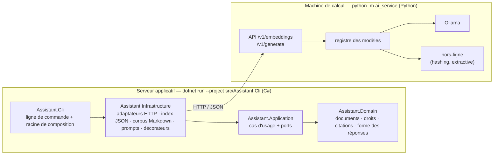

# Assistant documentaire RAG — version C# / Python

**Concevoir une application IA maintenable avec la Clean Architecture : jusqu'où peut-on isoler le modèle ?**

La même application que [`fyc-assistant-rag`](../fyc-assistant-rag) (Python), avec **l'application en C#**
et **les modèles d'IA en Python**. Les deux programmes ne partagent que le contrat HTTP
(`docs/contrat-http.md`) : ni code, ni langage, ni bibliothèque. C'est l'argument de la séquence 2.3
poussé jusqu'au bout — en entreprise, les machines de calcul hébergent les modèles, les serveurs
applicatifs hébergent l'application, et les deux équipes n'écrivent pas forcément dans le même langage.

- Application : **.NET 8**, C# 12, aucun paquet tiers (`System.Text.Json`, `HttpClient`) ; xUnit pour les tests.
- Service IA : **Python 3.11+**, bibliothèque standard, identique à celui de la version Python (copié tel quel).
- Mode hors-ligne intégré (embeddings hachés, générateur extractif) : tout fonctionne sans modèle ni GPU.
- Vrais modèles via [Ollama](https://ollama.com) : `bge-m3` + `llama3.2:3b` par défaut, comme la version Python.

## Architecture



La règle de dépendance est vérifiée par **les références de projets** (un `.csproj` ne peut pas
importer ce qu'il ne référence pas) **et par un test** (`ArchitectureTests`, réflexion sur les
assemblies compilés).

```
src/Assistant.Domain/           entités, AccessPolicy, Citations, OutputRules — ne référence rien
src/Assistant.Application/      ports (IEmbedder, IGenerator, IVectorIndex…), IndexCorpus, AskQuestion,
                                CheckStatus, RecordSnapshot + SnapshotComparer, OutputValidatingGenerator
src/Assistant.Infrastructure/   HttpEmbedder/HttpGenerator, MarkdownCorpus, ParagraphSplitter, JsonVectorIndex,
                                FilePromptRepository, JsonSnapshotStore, SystemClock, décorateurs (cache, journal, tentatives)
src/Assistant.Cli/              Program (index, ask, status, snapshot), Composition (le seul endroit qui connaît tout), AppConfig
tests/Assistant.Tests/          67 tests xUnit : domaine, cas d'usage avec doubles, adaptateurs, contrat HTTP contre un faux
                                service, règle de dépendance
ai_service/                     service IA en Python, copié de la version Python (registre, backends Ollama / hors-ligne)
tests_python/                   ses tests (bibliothèque standard)
config/app.json                 hors-ligne, corpus Solvéo · app-ollama.json : vrais modèles, corpus réel · ai_service.toml : modèles servis
prompts/answer.json             prompt versionné (answer-v2.json : la variante de la séquence 3.3)
corpus/                         solveo/ (9 documents fictifs) · service-public/ (322 fiches réelles, Licence Ouverte 2.0)
eval/questions*.json            jeux de questions partagés avec la version Python
docs/contrat-http.md            le contrat entre les deux programmes — la seule chose qu'ils partagent
```

## Démarrage rapide (hors-ligne)

Prérequis : [.NET 8 SDK](https://dotnet.microsoft.com/download/dotnet/8.0) et Python 3.11+.

Terminal 1 — le service IA (Python) :

```bash
python -m ai_service
```

Terminal 2 — l'application (C#) :

```bash
dotnet build src/Assistant.Cli
dotnet run --project src/Assistant.Cli -- index
dotnet run --project src/Assistant.Cli -- ask "Combien de jours de télétravail par semaine ?" -v
dotnet run --project src/Assistant.Cli -- ask "Quelle est la fourchette de salaire d'un consultant senior ?" --user bruno
dotnet run --project src/Assistant.Cli -- status
```

**Les deux verdicts de la problématique :**

```bash
# Changer le modèle de génération : aucun problème, même index
dotnet run --project src/Assistant.Cli -- ask "Combien de jours de congés ?" --generation-model extractive-bruite -v

# Changer le modèle d'embeddings : refus explicite, il faut réindexer
dotnet run --project src/Assistant.Cli -- ask "Combien de jours de congés ?" --embedding-model hashing-512
```

Instantanés (figer, changer une chose, mesurer la dérive) :

```bash
dotnet run --project src/Assistant.Cli -- snapshot record reference --limit 8
dotnet run --project src/Assistant.Cli -- snapshot record bruite --limit 8 --generation-model extractive-bruite
dotnet run --project src/Assistant.Cli -- snapshot compare reference bruite
```

## Avec de vrais modèles

Ollama et les modèles s'installent comme pour la version Python (`../fyc-assistant-rag/docs/installation.md`).
Puis, le service IA relancé :

```bash
dotnet run --project src/Assistant.Cli -- index --config config/app-ollama.json
dotnet run --project src/Assistant.Cli -- ask "Combien de jours dure le congé de paternité ?" --config config/app-ollama.json -v
```

Mesuré le 11/09/2026 (RTX 3070 8 Go) : indexation des 3 505 morceaux en 68 s avec `bge-m3`, réponse
citée en 3,6 s avec `llama3.2:3b` — les mêmes ordres de grandeur que la version Python, puisque le
temps est passé dans le service IA, pas dans l'application.

## Tests

```bash
dotnet test                                              # 67 tests C#, sans IA ni réseau
python -m unittest discover -s tests_python -t .         # 18 tests du service IA
```

## Ce que la version C# montre que la version Python ne peut pas montrer

| Point | Python | C# |
|---|---|---|
| La règle de dépendance | vérifiée par un test qui analyse les `import` | **imposée par le compilateur** (références de projets) et vérifiée par un test |
| Le service IA | même langage que l'application : on *pourrait* tricher en important `ai_service` | **autre langage** : tricher est impossible, seul le contrat HTTP existe |
| L'index JSON | écrit et lu par Python | **le même fichier se lit des deux côtés** (`JsonVectorIndexTests`) : c'est le modèle d'embeddings qui doit correspondre, pas le langage |
| Les ports | `Protocol` (typage structurel) | `interface` (typage nominal) : un adaptateur *déclare* qu'il implémente le port |
| Les décorateurs | classes qui imitent le port | classes qui implémentent l'interface : le compilateur garantit la substituabilité |

Ce que les deux versions partagent : les corpus, les jeux de questions, les prompts (même texte, même
version déclarée), la configuration (mêmes clés, JSON d'un côté, TOML de l'autre), le format des index
et des instantanés, le service IA, et surtout **les mêmes frontières aux mêmes endroits**.

## Où la problématique apparaît dans le code

| Séquence | Dans le code |
|---|---|
| 1.3 / 2.3 — le modèle derrière un port | `Application/Ports.cs` (`IEmbedder`, `IGenerator`) · `Infrastructure/HttpAiClient.cs` |
| 2.2 — un cœur testable sans IA | `Tests/UseCaseTests.cs` avec les doubles de `Tests/Fakes.cs` · `ArchitectureTests` |
| 2.3 — substituer le générateur | `--generation-model` : même index, rien d'autre à changer |
| 3.1 — non-déterminisme | vérification déterministe des citations (`Domain/Rules.cs`) · tentatives · instantanés |
| 3.2 — les données sont du code | `IndexModelMismatchException` · découpage dans le manifeste · seuil par modèle et par corpus (`config/*.json`) |
| 3.3 — le prompt | `prompts/answer.json`, version + empreinte dans chaque trace · `--prompt answer-v2` |
| 4.1 — isoler l'incertitude | droits filtrés **avant** le prompt · `Composition.Decorate()` : cache, journal, tentatives, validation de forme (`Application/Guards.cs`) |
| 4.2 — versionner ensemble | `IndexManifest` · `AnswerTrace` · `status` (`CheckStatus`) · `snapshot record/compare` · port `IClock` |
| 4.3 — les limites | index JSON à recherche exhaustive, aucune base vectorielle |

## Limites connues

- Le banc d'essai et les scripts d'expériences n'ont pas été portés : ils vivent dans la version Python et
  produisent des rapports que cette version ne fait que reproduire à la main (`snapshot`).
- Pas d'API HTTP de l'application (`serve`) dans cette version.
- Les identifiants d'index diffèrent entre les deux versions pour un même corpus et un même modèle : la
  sérialisation du découpage dans l'empreinte n'est pas octet pour octet la même. Le fichier, lui, se lit
  des deux côtés.
