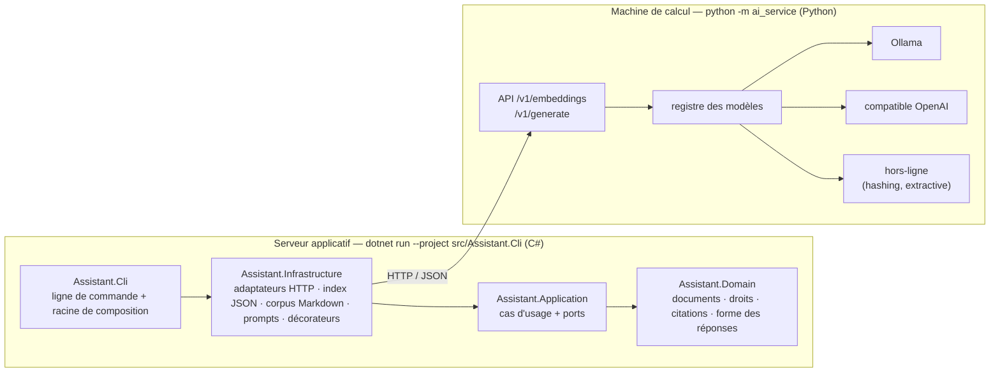

# Assistant documentaire RAG — version C# / Python

**Concevoir une application IA maintenable avec la Clean Architecture : jusqu'où peut-on isoler le modèle ?**

La même application que [`fyc-assistant-rag-python-full`](https://github.com/arthur-herve/fyc-assistant-rag-python-full) (Python), avec **l'application en C#**
et **les modèles d'IA en Python**. Les deux programmes ne partagent que le contrat HTTP
(`docs/contrat-http.md`) : ni code, ni langage, ni bibliothèque. C'est l'argument de la séquence 2.3
poussé jusqu'au bout — en entreprise, les machines de calcul hébergent les modèles, les serveurs
applicatifs hébergent l'application, et les deux équipes n'écrivent pas forcément dans le même langage.

- Application : **.NET 8**, C# 12, aucun paquet tiers (`System.Text.Json`, `HttpClient`) ; xUnit pour les tests.
- Service IA : **Python 3.11+**, bibliothèque standard, code identique à celui de la version Python (copié tel quel) ; sa configuration ajoute seulement l'alias `hashing-stem4` pour l'exemple S1.3.
- Mode hors-ligne intégré (embeddings hachés, générateur extractif) : tout fonctionne sans modèle ni GPU.
- Vrais modèles via [Ollama](https://ollama.com) : `bge-m3` + `llama3.2:3b` dans la configuration `config/app-ollama.json`.
- Banc d'essai, cinq expériences reproductibles, test statistique, exemple jouet de la séquence 1.3, dix ADR : tout ce que le cours promet est dans ce dépôt (voir « Où la problématique apparaît dans le code »).

**Par où commencer** : [`docs/installation.md`](docs/installation.md) (20 minutes hors-ligne), puis le démarrage rapide ci-dessous, puis
[`exemples/s1.3-transfert-naif/`](exemples/s1.3-transfert-naif/README.md) pour voir le transfert naïf marcher… et casser.
Les exercices des séquences sont dans [`exercices/`](exercices/README.md) (S2.2, S3.1, S4.1), et le cas pratique de fin de
cours dans [`cas-pratique/`](cas-pratique/README.md) (S5.1).

## Architecture


```mermaid
flowchart LR
    subgraph APP["Serveur applicatif — dotnet run --project src/Assistant.Cli (C#)"]
        direction TB
        I["Assistant.Cli<br/>ligne de commande + racine de composition"] --> INF
        INF["Assistant.Infrastructure<br/>adaptateurs HTTP · index JSON · corpus Markdown · prompts · décorateurs"] --> A
        A["Assistant.Application<br/>cas d'usage + ports"] --> D["Assistant.Domain<br/>documents · droits · citations · forme des réponses"]
    end
    subgraph IA["Machine de calcul — python -m ai_service (Python)"]
        S["API /v1/embeddings<br/>/v1/generate"] --> R["registre des modèles"]
        R --> B1["Ollama"]
        R --> B2["compatible OpenAI"]
        R --> B3["hors-ligne<br/>(hashing, extractive)"]
    end
    INF -- "HTTP / JSON" --> S
```

La règle de dépendance est vérifiée par **les références de projets** (un `.csproj` ne peut pas
importer ce qu'il ne référence pas) **et par un test** (`ArchitectureTests`, réflexion sur les
assemblies compilés jusqu'au code IL : hors de `Composition`, aucun type de `Assistant.Cli` ne touche à
l'infrastructure, quelle que soit l'écriture des sources). Ce test attrape les erreurs, pas la malveillance :
il ne suit ni le corps des méthodes de `Composition` (une fabrique qui renvoie un adaptateur typé `object`
passe), ni une constante (`const`) d'un adaptateur, recopiée à la compilation, ni un chargement par
réflexion (`Type.GetType("…")`), ni un argument d'attribut de type énuméré, ni un pointeur de fonction
(détail dans `ArchitectureTests.InfrastructureLeaks`). La ligne de commande lit le JSON avec sa propre
copie des fichiers de `src/Shared/` : elle ne nomme pas l'infrastructure.

```
src/Assistant.Domain/           entités, AccessPolicy, Citations, OutputRules — ne référence rien
src/Assistant.Application/      ports (IEmbedder, IGenerator, IVectorIndex…), IndexCorpus, SearchPassages, AskQuestion,
                                CheckStatus, RecordSnapshot + SnapshotComparer, OutputValidatingGenerator
src/Assistant.Infrastructure/   HttpEmbedder/HttpGenerator, MarkdownCorpus, ParagraphSplitter, JsonVectorIndex,
                                FilePromptRepository, JsonSnapshotStore, SystemClock, décorateurs (cache, journal, tentatives)
src/Assistant.Cli/              Program (index, ask, status, snapshot, benchmark, experience, serve), HttpApi (API HTTP de
                                l'application), Composition (le seul endroit qui connaît tout), AppConfig, Benchmark, Experiments
src/Shared/                     TextFiles (lecture UTF-8 stricte), JsonText (lecture JSON stricte) : ni un projet ni une
                                couche, un même source compilé dans Assistant.Infrastructure et Assistant.Cli, chacun sa
                                copie interne
tests/Assistant.Tests/          655 tests xUnit : domaine, cas d'usage avec doubles, adaptateurs, contrat HTTP contre un faux
                                service, API HTTP contre des doubles, règle de dépendance, test statistique (S3.1), calculs du banc,
                                noms de tests cités par la documentation
exemples/s1.3-transfert-naif/   le transfert naïf en moins de 300 lignes : port dans le domaine, substitution, puis panne silencieuse
exercices/                      exercices de code : énoncés et corrigés (S2.2 avec son kit de départ autonome, S3.1, S4.1)
cas-pratique/                   S5.1 : une version mal structurée du fil rouge à rendre maintenable, énoncé, grille, corrigé
ai_service/                     service IA en Python, copié de la version Python (registre, backends Ollama / hors-ligne)
tests_python/                   ses tests (bibliothèque standard)
config/app.json                 hors-ligne, corpus Solvéo · app-ollama.json : vrais modèles, corpus réduit (50 fiches) ·
                                app-ollama-complet.json : corpus complet (322 fiches) · ai_service.toml : modèles servis
prompts/answer.json             prompt versionné (answer-v2.json : la variante de la séquence 3.3)
corpus/                         solveo/ (9 documents fictifs) · service-public-reduit/ (50 fiches réelles, le corpus du cours) ·
                                service-public/ (322 fiches, Licence Ouverte 2.0, pour les expériences à l'échelle)
eval/questions*.json            jeux de questions · eval/resultats/ : rapports du banc et des expériences
docs/contrat-http.md            le contrat entre les deux programmes — la seule chose qu'ils partagent
docs/adr/                       dix décisions d'architecture · docs/artefacts.md : les sept artefacts à versionner ensemble
```

## Démarrage rapide (hors-ligne)

Prérequis : [.NET 8 SDK](https://dotnet.microsoft.com/download/dotnet/8.0) et Python 3.11+.

Terminal 1 — le service IA (Python) :

```bash
python -m ai_service
```

Terminal 2 — l'application (C#) :

```bash
dotnet build src/Assistant.Cli
dotnet run --project src/Assistant.Cli -- index
dotnet run --project src/Assistant.Cli -- ask "Combien de jours de télétravail par semaine ?" -v
dotnet run --project src/Assistant.Cli -- ask "Quelle est la fourchette de salaire d'un consultant senior ?" --user alice   # la grille (RH) est filtrée avant le prompt : réponse tirée d'une fiche publique, voir -v
dotnet run --project src/Assistant.Cli -- ask "Quelle est la fourchette de salaire d'un consultant senior ?" --user bruno   # autorisé
dotnet run --project src/Assistant.Cli -- status
dotnet run --project src/Assistant.Cli -- index --if-stale     # réindexe seulement si status dit « à refaire »
```

Toutes les commandes se lancent depuis la racine du dépôt. La commande vient d'abord, puis ses options : une option
inconnue, abrégée (`--us` pour `--user`), d'une autre commande ou placée avant la commande est refusée, jamais ignorée.
`--` termine les options : ce qui suit est un argument, même un mot qui commence par un tiret (`ask -- -télétravail`) ;
sans `--`, un tel mot n'est un argument que s'il est `-`, un nombre négatif, ou si son nom (ce qui précède un éventuel
`=`) contient une espace (`ask "-vingt degrés ?"`).
Options utiles : `--json` (sortie JSON de `ask` et `status`), `--questions <fichier>` et `--limit N` (au moins 1, comme
pour le banc et les expériences) pour `snapshot record` ; `snapshot list` n'a que les options communes (`--config`…).
Codes de retour : 0 ok · 1 erreur, saisie comprise · `status` : 2 à refaire, 3 non vérifié · `index --if-stale` : 3 non
vérifié. Variables d'environnement : `ASSISTANT_CONFIG` (fichier de configuration, sans `--config`), `AI_SERVICE_URL`
(adresse du service IA, pour un déploiement sur deux machines ; elle remplace `base_url`, qui reste obligatoire et
vérifiée dans le fichier), `ASSISTANT_LOG=INFO` ou `info` (journal des décorateurs, aussi avec `-v` ; toute autre
valeur est ignorée ; ni la variable ni `-v` ne valent pour le banc, mais la commande `experience` lit la variable).
`--config`, `--embedding-model`, `--generation-model` ou `--prompt` donnés vides (`""`) valent la configuration,
`--out ""` le dossier daté, `--questions ""` le jeu par défaut et `--validate-with ""` l'absence de validation, comme
absents.

La configuration (`config/*.json`) est en UTF-8 (une marque d'ordre des octets est acceptée ; sinon le message donne
l'octet fautif et sa position) et en JSON strict : une clé en double, un `\ud800` isolé, `NaN`, un entier de plus
de 4300 chiffres ou plus de 64 niveaux d'imbrication sont refusés au chargement, avec le nom du fichier. JSON n'a
pas de commentaires : une clé qui commence par `_` en tient lieu, à tous les niveaux (y compris `decorators`,
`retrieval.min_score` et `users`).

**Les deux verdicts de la problématique :**

```bash
# Changer le modèle de génération : aucun problème, même index
dotnet run --project src/Assistant.Cli -- ask "Combien de jours de congés ?" --generation-model extractive-bruite -v

# Changer le modèle d'embeddings : refus explicite, il faut réindexer
dotnet run --project src/Assistant.Cli -- ask "Combien de jours de congés ?" --embedding-model hashing-512
```

Instantanés (figer, changer une chose, mesurer la dérive) :

```bash
dotnet run --project src/Assistant.Cli -- snapshot record reference --limit 8
dotnet run --project src/Assistant.Cli -- snapshot record bruite --limit 8 --generation-model extractive-bruite
dotnet run --project src/Assistant.Cli -- snapshot compare reference bruite
```

Banc d'essai et expériences (mesurer, pas asserter — tout fonctionne hors-ligne, et avec de vrais modèles) :

```bash
dotnet run --project src/Assistant.Cli -- benchmark --embedding hashing hashing-512 --generation extractive extractive-bruite --runs 3
dotnet run --project src/Assistant.Cli -- experience cace-decoupage                        # 800 → 300 caractères : la dérive
dotnet run --project src/Assistant.Cli -- experience changement-embeddings --other hashing-512
dotnet run --project src/Assistant.Cli -- experience changement-generateur --other extractive-bruite
dotnet run --project src/Assistant.Cli -- experience prompt-v2
dotnet run --project src/Assistant.Cli -- experience stabilite --runs 3
```

Chaque expérience change une seule chose, enregistre deux instantanés et écrit `eval/resultats/exp-<nom>-<AAAAMMJJ-HHMMSS>/rapport.md`
(sous la racine du projet quel que soit le dossier courant ; le chemin affiché part du dossier courant ; le banc, lui,
écrit dans `eval/resultats/<AAAAMMJJ-HHMMSS>/` ; dans les deux cas, si ce dossier existe déjà, par exemple pour deux
commandes lancées dans la même seconde, le nom reçoit `-2`, `-3`…).
Un modèle d'embeddings sans seuil configuré reçoit la valeur `default` : l'expérience le signale en console et dans son
rapport (ADR 0004). Pour `changement-embeddings` et `changement-generateur`, l'alias `--other` est vérifié auprès du
service IA (GET /v1/models : servi, et du bon type ; une réponse hors contrat est refusée : octets qui ne sont pas de
l'UTF-8 (une marque d'ordre des octets est acceptée), alias non textuel, ou JSON qui n'est pas strict — clé en double,
même là où rien n'est lu, `NaN`, entier de plus de 4300 chiffres, plus de 64 niveaux, chaîne qui n'est pas du texte)
avant tout index.

Un jeu de questions (banc, expériences, `snapshot record`) est lu strictement : seules les clés `id`, `user`, `question`,
`answerable`, `expected_documents`, `forbidden_documents` et `expected_keywords` sont permises, plus celles qui
commencent par `_` : des commentaires, sans effet, comme dans la configuration. `answerable` vaut `true` ou `false`,
chaque identifiant est unique. Le fichier est en UTF-8 (une marque d'ordre des octets est acceptée ; un fichier en
latin-1 est refusé avec l'octet fautif et sa position) et en JSON strict : une clé en double, `NaN` ou `Infinity`
(une erreur de syntaxe pour System.Text.Json), plus de 64 niveaux d'imbrication, une chaîne qui n'est pas du texte (un
`\ud800` isolé, même dans un commentaire) sont refusés. Une erreur nomme le fichier et ce qui est en faute : la
question (son numéro) et, s'il y a lieu, le champ ; pour un défaut du JSON lui-même, repéré dès sa lecture, seulement
ce défaut (et la clé, pour une clé en double).

L'application peut aussi être servie en HTTP :

```bash
dotnet run --project src/Assistant.Cli -- serve                      # port 8000
curl http://127.0.0.1:8000/health
curl -X POST http://127.0.0.1:8000/v1/ask -H "Content-Type: application/json" -d '{"user": "alice", "question": "Combien de jours de teletravail ?"}'
curl http://127.0.0.1:8000/v1/status                                 # 200 à jour · 409 à refaire · 503 non vérifié
curl -X POST http://127.0.0.1:8000/v1/index -d '{}'                  # reconstruit l'index
```

Erreurs, en JSON (`{"error": {"code": …, "message": …}}`) :

| HTTP | `code` | Cause |
|---|---|---|
| 400 | `invalid_json` | corps qui n'est pas un objet JSON strict en UTF-8 : octets qui ne sont pas de l'UTF-8, clé en double, chaîne avec un surrogate UTF-16 isolé, `NaN` ou `Infinity` (une erreur de syntaxe, avec le message de System.Text.Json), plus de 64 niveaux d'imbrication |
| 400 | `invalid_request` | `user` ou `question` présent mais pas une chaîne (absent ou `null`, il vaut `""` : 403 `unknown_user` pour `user`, 400 `invalid_question` pour `question`) ; codage de transfert qui n'est pas `chunked` seul (`gzip, chunked`, sous Windows ; sous Linux, `HttpListener` le refuse lui-même : 501) ; corps lu plus court que son `Content-Length` (sous Linux ; sous Windows, http.sys répond lui-même) |
| 400 | `invalid_question` | question vide |
| 403 | `unknown_user` | utilisateur absent de la configuration |
| 404 | `not_found` | route inconnue, quelle que soit la méthode |
| 405 | `method_not_allowed` | route connue, autre méthode : l'en-tête `Allow` donne celles permises (`GET, HEAD` pour `/health` et `/v1/status`, `POST` pour `/v1/index` et `/v1/ask`) ; HEAD est accepté partout où GET l'est (mêmes statut et en-têtes, sans corps) |
| 409 | `index_unusable` | aucun index, index construit avec un autre modèle d'embeddings, ou remplacé pendant la question deux fois de suite (« Reposez la question ») |
| 413 | `payload_too_large` | corps de plus de 16 Mio (16 777 216 octets) sur `/v1/index` ou `/v1/ask` : refusé sans être lu quand `Content-Length` l'annonce, dès que la limite est franchie pour un envoi en morceaux (dont le `Content-Length` ne compte pas) |
| 500 | `unreadable_state` | corpus mal formé ou vide, prompt ou index illisible |
| 500 | `index_write_failed` | index impossible à écrire (l'index en service reste alors le précédent) |
| 500 | `internal_error` | erreur imprévue |
| 502 | `ai_service_error` | service IA injoignable, en erreur, ou réponse hors contrat |

`HttpListener` refuse lui-même certaines requêtes mal formées, avant l'application : il répond alors par une page
HTML (et non par le JSON de l'application), avec son propre statut (400, 411, 413, 414, 501, 505). Par exemple, un
POST sans corps reçoit 411 (« Length Required »), d'où le `-d '{}'` des exemples. Le détail varie entre Windows
(http.sys) et Linux.

## Avec de vrais modèles

Ollama et les modèles : [`docs/installation.md`](docs/installation.md), étapes 5 et 6. Puis, le service IA relancé :

```bash
dotnet run --project src/Assistant.Cli -- index --config config/app-ollama.json
dotnet run --project src/Assistant.Cli -- ask "Combien de jours dure le congé de paternité ?" --config config/app-ollama.json -v
dotnet run --project src/Assistant.Cli -- benchmark --config config/app-ollama.json --embedding bge-m3 nomic --generation llama3-2-3b --questions eval/questions-service-public.json --validate-with eval/questions-service-public-validation.json --runs 1
```

Les mesures de référence (corpus réduit, `bge-m3` + `llama3.2:3b`, RTX 3070 8 Go ; celles du corpus complet sont dans le dépôt Python) sont dans
[`eval/resultats/`](eval/resultats/README.md). Le temps est passé dans le service IA, pas dans l'application :
le langage de celle-ci ne change rien aux ordres de grandeur.

### Quels modèles pour quelle machine ?

Ordres de grandeur, à confirmer avec le banc d'essai sur vos machines.

| Machine | Embeddings | Génération | Temps de réponse attendu |
|---|---|---|---|
| 8 Go de RAM, sans GPU | `all-minilm`, `nomic` | `gemma3-1b`, `qwen3-1b7` | quelques secondes à ~20 s |
| 16 Go de RAM, sans GPU | `nomic`, `mxbai`, `bge-m3` | `llama3-2-3b`, `qwen3-4b`, `gemma3-4b` | ~10 à 40 s |
| GPU de 6 Go et plus | tous | `mistral-7b` et au-delà | quelques secondes |

Les alias disponibles et leur description sont dans `config/ai_service.toml` (ou `GET http://127.0.0.1:8100/v1/models`).
Ajouter un modèle = ajouter un bloc dans ce fichier, sans toucher au code.

Les modèles `st-*` (sentence-transformers) sont optionnels : `pip install -r requirements-ai-optional.txt` sur la machine
du service IA.

## Tests

```bash
dotnet test                                              # 655 tests C#, sans IA ni réseau (dont un test statistique, S3.1)
python -m unittest discover -s tests_python -t .         # 56 tests du service IA
```

## Ce que la version C# montre que la version Python ne peut pas montrer

| Point | Python | C# |
|---|---|---|
| La règle de dépendance | vérifiée par un test qui analyse les `import` | **imposée par le compilateur** (références de projets) et vérifiée par un test |
| Le service IA | même langage que l'application : on *pourrait* tricher en important `ai_service` | **autre langage** : tricher est impossible, seul le contrat HTTP existe |
| L'index JSON | écrit et lu par Python | **écrit et lu en C#, avec les vecteurs du service Python** : c'est le modèle d'embeddings qui doit correspondre, pas le langage |
| Les ports | `Protocol` (typage structurel) | `interface` (typage nominal) : un adaptateur *déclare* qu'il implémente le port |
| Les décorateurs | classes qui imitent le port | classes qui implémentent l'interface : le compilateur garantit la substituabilité |

Ce que les deux versions partagent : les corpus, les jeux de questions, le texte des prompts, la configuration
(mêmes clés, JSON d'un côté, TOML de l'autre), le corps des requêtes au service IA (mêmes champs, mêmes valeurs, en
JSON UTF-8), le format des rapports du banc et des expériences, le service IA, et surtout **les mêmes frontières
aux mêmes endroits**. Détail : ADR 0009.

Et ce que ce dépôt ne fait pas, par choix : pas de service IA en C# (il effacerait l'argument), pas de base
vectorielle (l'index JSON *est* la base vectorielle locale du cours, en un fichier — ADR 0007), pas de
réentraînement (un RAG n'entraîne rien : il se réindexe, `docs/artefacts.md`).

## Où la problématique apparaît dans le code

| Séquence | Dans le code |
|---|---|
| 1.3 — le transfert naïf | `exemples/s1.3-transfert-naif/` : port **dans le domaine**, substitution du générateur (marche), substitution des embeddings (casse en silence) |
| 1.3 / 2.3 — le modèle derrière un port | `src/Assistant.Application/Ports.cs` (`IEmbedder`, `IGenerator`, dans la couche application) · `src/Assistant.Infrastructure/HttpAiClient.cs` · ADR 0001, 0009 |
| 2.1 — le cahier des charges | règles métier dans `src/Assistant.Domain/Rules.cs` (droits, citations, forme) · corpus du cours `corpus/service-public-reduit/` (50 fiches) |
| 2.2 — un cœur testable sans IA | `tests/Assistant.Tests/UseCaseTests.cs` avec les doubles de `tests/Assistant.Tests/Fakes.cs` · `ArchitectureTests` · exercice : `exercices/s2.2-coeur-metier/` (kit de départ autonome, 20 tests fournis) |
| 2.3 — substituer le générateur | `--generation-model` : même index, rien d'autre à changer · `experience changement-generateur` |
| 3.1 — non-déterminisme | vérification déterministe des citations (`src/Assistant.Domain/Rules.cs`) · tentatives · `tests/Assistant.Tests/StatisticalTests.cs` (tolérance et faux échec calculés) · `benchmark` (stabilité, `--validate-with`) · `experience stabilite` · exercice : `exercices/s3.1-evaluation-statistique/` |
| 3.2 — les données sont du code | `IndexModelMismatchException` (`SearchPassages`) · découpage dans le manifeste · seuil par modèle **et par corpus** (`config/app-ollama*.json`) · `experience cace-decoupage`, `experience changement-embeddings` |
| 3.3 — le prompt | `prompts/answer.json`, version + empreinte du contenu dans chaque trace · `--prompt answer-v2` · `experience prompt-v2` · ADR 0005 |
| 4.1 — isoler l'incertitude | droits filtrés **avant** le prompt · `Composition.Decorate()` : cache, journal, tentatives, validation de forme (`src/Assistant.Application/Guards.cs`) · ADR 0006, 0008 · exercice : `exercices/s4.1-decorateur-de-validation/` |
| 4.2 — versionner ensemble | `IndexManifest` · `AnswerTrace` · `status` (`CheckStatus`) · `index --if-stale` · `snapshot record/compare` · port `IClock` · `docs/artefacts.md` (sept artefacts) |
| 4.3 — les limites | index JSON à recherche exhaustive, aucune base vectorielle, aucun paquet tiers (ADR 0007) ; quatre projets .NET et un service Python pour une ligne de commande : est-ce trop ? |
| 5.1 / 5.2 — le cas pratique | `cas-pratique/` : programme de départ mal structuré (`depart/Program.cs`), énoncé, grille d'évaluation, corrigé de référence (ce dépôt) |
| 5.3 — la réponse | la frontière est le contrat, pas le langage : l'application C# ne parle au service IA en Python que par le contrat HTTP (`docs/contrat-http.md`, ADR 0009) |

## Limites connues

- Le dépôt de départ de l'exercice S4.1 (branche sans le décorateur) attend le découpage du cours en étiquettes Git.
- Les temps sans carte graphique ne sont pas mesurés (voir `docs/installation.md`).
- L'API HTTP traite les requêtes une à la fois : une génération longue retarde `/health`, et un client qui annonce
  un corps sans l'envoyer bloque toute l'API (environ 2 minutes sous Windows, où http.sys finit par couper la
  connexion ; sans limite sous Linux). Suffisant pour le cours, à savoir pour un déploiement.
