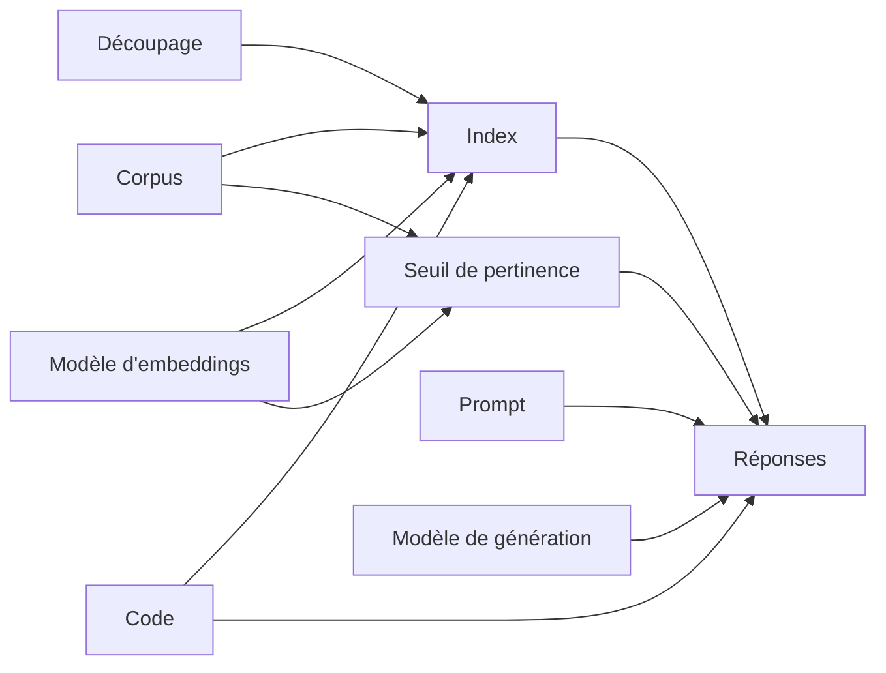

# Versionner ensemble : les artefacts d'un assistant RAG (séquence 4.2)

Une application de gestion classique se résume à du code et une base de données. Un assistant
RAG dépend de **sept artefacts** qui changent à des rythmes différents, entretenus par des
personnes différentes, et dont certains dépendent silencieusement des autres. Le code est le seul
que Git versionne naturellement.

## Les sept artefacts

| Artefact | Où il vit | Qui le change | Ce qui en dépend | Comment on le trace |
|---|---|---|---|---|
| **Code** | `src/Assistant.*` (C#), `ai_service/` (Python) | les développeurs | tout | Git |
| **Corpus** | `corpus/<nom>/*.md` | les métiers (RH, juridique…), la DILA pour Service-Public | l'index | `corpus_fingerprint` dans le manifeste de l'index (empreinte des textes **et** des droits d'accès) |
| **Découpage** | `[splitter]` de la configuration | les développeurs | l'index, les seuils | `splitter` dans le manifeste ; `index_id` change avec lui |
| **Index** | `data/index*.json` | personne : il est **dérivé** | les réponses | `IndexManifest` : `index_id`, modèle concret, dimension, empreinte du corpus, découpage, date |
| **Prompts** | `prompts/*.json` | développeurs ou métiers | les réponses (pas l'index) | `version` déclarée + empreinte du contenu (version, system, user — indépendante du format de fichier, identique dans la version Python), inscrites dans chaque `AnswerTrace` |
| **Modèle d'embeddings** | derrière un alias du service IA (`config/ai_service.toml`) | l'équipe qui exploite le service IA | l'index, les seuils de pertinence | identifiant concret renvoyé par le service (`ollama:bge-m3@790764…`) et comparé au manifeste **à chaque question** |
| **Modèle de génération** | derrière un alias du service IA | l'équipe IA | les réponses (pas l'index) | identifiant concret dans chaque `AnswerTrace` |

Deux artefacts ne sont pas des fichiers mais des **réglages** qui dépendent des précédents :
le **seuil de pertinence** (par modèle d'embeddings *et* par corpus : 0,46 pour `bge-m3` sur
Solvéo, 0,65 sur Service-Public) et les **paramètres de génération** (température, jetons,
graine). Ils entrent dans l'empreinte de configuration des instantanés.

## Qui dépend de qui



Lecture : tout ce qui est en amont de **Index** impose une **réindexation** quand il change.
Tout ce qui n'arrive qu'aux **Réponses** se change sans toucher aux données stockées — c'est
le verdict « le générateur est un détail », et sa limite : il change quand même les sorties.

## Ce que le code détecte, et quand

| Changement | Détecté par | Moment | Réaction |
|---|---|---|---|
| Modèle d'embeddings servi ≠ modèle de l'index | `SearchPassages` (`IndexModelMismatchException`) | à chaque question | erreur : réindexer |
| Corpus modifié depuis l'indexation | `assistant status` (`CheckStatus`) | à la demande | verdict « à refaire » |
| Découpage modifié | `status` | à la demande | verdict « à refaire » |
| Prompt modifié | version + empreinte dans chaque trace ; `snapshot compare` | à chaque réponse ; à la demande | on sait *quel* prompt a produit *quelle* réponse |
| Modèle de génération changé | identifiant dans la trace ; `snapshot compare` | idem | taux de dérive mesuré |
| Seuil, température, top_k… | empreinte de configuration des instantanés | `snapshot compare` | différences listées à côté de la dérive |

`status` ne remplace pas la vérification à chaque question : un service IA peut changer de
modèle entre deux appels. Il sert avant une démonstration, un déploiement ou un banc d'essai.
Il interroge le service IA **sans passer par le cache d'embeddings** : un cache est lui-même un
artefact lié au modèle, il masquerait un changement de modèle servi.

## La réindexation, équivalent RAG du réentraînement

Un modèle appris se réentraîne quand ses données changent ; un assistant RAG se **réindexe**
quand son corpus, son découpage ou son modèle d'embeddings change. Même logique : un artefact
dérivé (poids / index) doit être reconstruit, on ne peut pas le corriger à la main, et il faut
savoir de quoi il a été dérivé. Le manifeste de l'index joue le rôle de la fiche d'entraînement
d'un modèle. Le vrai réentraînement (modifier les poids d'un modèle) est hors du périmètre du
cours ; l'analogie s'arrête là.

Le cycle complet tient en deux commandes : `status` détecte, `index --if-stale` reconstruit —
seulement si `status` a dit « à refaire », rien si l'index est à jour, code de retour 3 si le
service IA est injoignable (on ne réindexe pas à l'aveugle). C'est ce que la problématique
appelle « un besoin de réentraînement » : ici, un besoin de réindexation, détecté et nommé.

## En pratique

```bash
A="dotnet run --project src/Assistant.Cli --"
$A status                                # l'index est-il encore valable ?
$A index --if-stale                      # le reconstruire seulement s'il ne l'est plus
$A snapshot record reference             # figer le comportement
# … changer une chose : prompt, modèle, découpage, seuil …
$A snapshot record candidat
$A snapshot compare reference candidat   # différences de configuration + dérive
$A experience cace-decoupage             # la même chose, automatisée, avec un rapport
```
